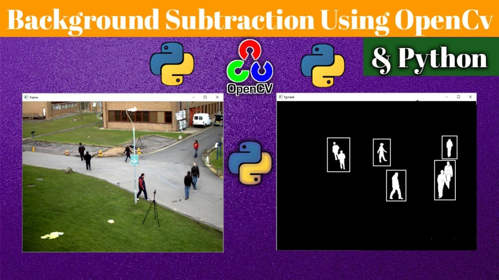
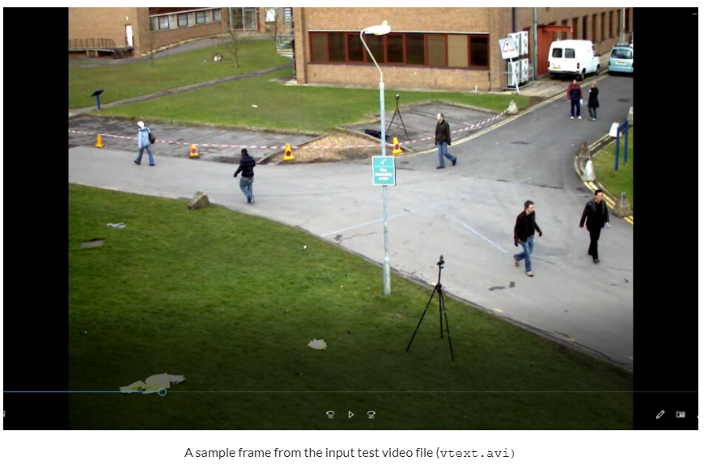
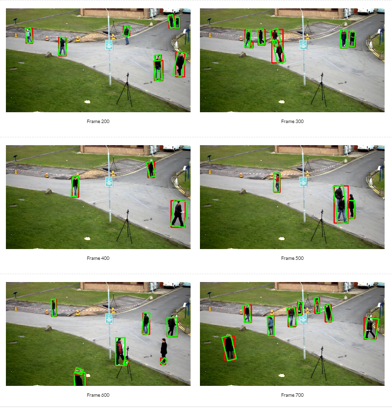

# Moving Object Detection using Background-Subtraction in OpenCV-Python

## 1. Objective

The objective of this project is to demonstrate object detection using background subtraction OpenCV-Python built-in functionalities. 
We illustrate the development process step by step and present sample detection results.

## 2. Background Subtraction

The objective of this project is to demonstrate object detection using background subtraction OpenCV-Python built-in functionalities. 
We illustrate the development process step by step and illustrate the intermediate and the final detection results.

### 2.1. Background Subtraction Algorithms.

Background subtraction is a simple approach for estimating and segmenting the background from image and then extracting it in order to 
detect potential potential foreground changes, due to motion or introduction of new objects to the imaged scene. One key assumption in 
background subtraction is that imaging camera system if fixed so that changes in the imaged scene are due to changes in the foreground 
and not displacement of the camera. 

Many fixed-camera real-world application make use of simple approaches, such as background subtraction to detect and track changes in 
the imaged scene. For example, in security camera applications, background subtraction can be used to detect people, vehicles and other 
objects of interest entering the imaged scene. The detection output of the background subtraction system can then fed into more 
sophisticated computer systems to analyze the detected objects of interest, such as tracking, counting, or recognizing them. 

There several variations of background subtraction algorithms in the literature and OpenCV has implemented three such algorithms,  
which are very easy to use through C++ and Python API. In this section, we shall briefly outline these four background subtraction algorithms.

#### 2.1.1 BackgroundSubtractorMOG

BackgroundSubtractorMOG is a Gaussian Mixture-based background vs. foreground segmentation algorithm. It models each background pixel 
using a mixture of K Gaussian distributions (K = 3 to 5). The weights of the mixture represent the time proportions that those colors 
stay in the scene. The probable background colors are the ones which stay longer and more static.

#### 2.1.2  BackgroundSubtractorMOG2

This is an improved version of the original BackgroundSubtractorMOG algorithm. One important feature of this algorithm is that it selects the 
appropriate number of gaussian distribution for each pixel, unlike the case for the original BackgroundSubtractorMOG2 algorithm which a  
fixed K gaussian distributions throughout the image. Thus, this new version of the algorithm provides better adaptability to artificial 
variations in scenes, such as those due to changes in illumination changes, shadow, etc. 

#### 2.1.3  BackgroundSubtractorGMG

This algorithm combines statistical background image estimation and per-pixel Bayesian segmentation. It uses first few (120 by default) 
frames for background modelling. It employs probabilistic foreground segmentation algorithm that identifies possible foreground objects 
using Bayesian inference. The estimates are adaptive; newer observations are more heavily weighted than old observations to accommodate 
variable illumination. Several morphological filtering operations like closing and opening are done to remove unwanted noise. Since the 
first 100 or frames are sued for modeling and estimating the background, this algorithm does not  yield reliable detection results for 
these frames. Thus, it is recommended to only start computing the change detection results after skipping 100 to 200 frames when the 
background has been estimated sufficiently well. 

#### 2.1.4 BackgroundSubtractorKNN()

This algorithm is based on the K-nearest neighbors background vs. foreground segmentation and classification algorithm. 
It was shown this this algorithm may be quite efficient when number of foreground pixels is low. Thus this algorithm may be 
more suitable for detecting small changes and objects.

## 3. Data

* We shall use the following OpenCV sample date video:

    * File: vtext.avi
    * Frame size: 575x768 pixels (RGB)
    * Number of frames = 795
    * Duration: 1 min 19 secs
    * Frame rate: 10frames/sec.

## 4. Development

* In this section, we shall develop the background-subtraction algorithms using OpenCV Python and illustrate the intermediate and final result:

  * Author: Mohsen Ghazel (mghazel)
  * Date: March 29th, 2021
  * Project: Object Detection via Background Subtraction

* The objective of this project is to demonstrate change and object detection and localization via background-subtraction using OpenCV-Python built-in functionalities:
  * Background subtraction is a way of estimating and eliminating the background from image.
* Changes are detected by extracting the moving foreground from the static background.

### 4.1. Step 1: Imports and global variables

<pre style="color:#000000;background:#e6ffff;font-size:10px;line-height:1.5;">#------------------------------------------------------
# Python imports and environment setup
#------------------------------------------------------
# opencv
import cv2
# numpy
import numpy as np
# matplotlib
import matplotlib.pyplot as plt
import matplotlib.image as mpimg

# input/output OS
import os 

# date-time to show date and time
import datetime

# Use %matplotlib notebook to get zoom-able &amp; resize-able notebook. 
# - This is the best for quick tests where you need to work interactively.
%matplotlib notebook

#------------------------------------------------------
# Global variables
#------------------------------------------------------
# OpenCV offers 4 background-subtraction algorithms:
#------------------------------------------------------
#  Method 1: BackgroundSubtractorMOG:
#     - It is a Gaussian Mixture-based 
#       Background/Foreground Segmentation Algorithm.
#  Method 2: BackgroundSubtractorMOG2:
#     - It is also a Gaussian Mixture-based 
#       Background/Foreground Segmentation Algorithm. 
#     - It provides better adaptability to varying 
#       scenes due illumination changes etc.
#  Method 3: BackgroundSubtractorGMG: 
#      - This algorithm combines statistical background 
#        image estimation and per-pixel Bayesian segmentation.
#  Method 4: BackgroundSubtractorKNN: 
#      - This algorithm is K-nearest neighbors 
#        clustering and classification.
#------------------------------------------------------
# Select the OpenCV background-subtraction method that 
# will be applied
#------------------------------------------------------
OPENCV_BACKGROUND_SUBTRACTION_METHOD = 1

#------------------------------------------------------
# Background subtraction is susceptible to noise:
#------------------------------------------------------
#  - This is due to artifitial changes due to 
#    illumination
#  - These sperious changes tend to be small and can 
#    be filtered out using an area threshold
#------------------------------------------------------
MIN_CONTOUR_AREA = 100

#------------------------------------------------------
# Background subtraction use the first K frames to
# model ad estimate the background:
#------------------------------------------------------
#  - Detection results obtained using the first K 
#    frames are not reliable
#  - Thus, we should skip the first K frames without
#    computing detection results.
#------------------------------------------------------
NUM_SKIPPED_INITIAL_FRAMES = 150

#------------------------------------------------------
# Test imports and display package versions
#------------------------------------------------------
# Testing the OpenCV version
print("OpenCV : ",cv2.__version__)
# Testing the numpy version
print("Numpy : ",np.__version__)

OpenCV :  3.4.8
Numpy :  1.19.2
</pre>

### 4.2. Step 2: Read the input video:
* We now read the input video file and display its number of frames.

<pre style="color:#000000;background:#e6ffff;font-size:10px;line-height:1.5;">#----------------------------------------------------
# Open and fixed-camera video file
#----------------------------------------------------
# the source video file name
video_file_path = "../data/OpenCV/vtest.avi"
# check if the reference image file exists
if(os.path.exists(video_file_path) == 0):
    print('Video file name DOES NOT EXIST! = ' + video_file_path)
# Read the reference image
cap = cv2.VideoCapture(video_file_path)
# check the status of the opened video file
if not cap.isOpened():
    print("Cannot read video file: " + video_file_path)
    exit();
# get the number of frames in the video file
num_video_frames = int(cap.get(cv2.CAP_PROP_FRAME_COUNT))
# display a message
print("Input video file: {0} has {1} frames.".format(video_file_path, num_video_frames))

Input video file: ../data/OpenCV/vtest.avi has 795 frames.
</pre>

### 4.3. Step 3: Setup OpenCV background subtraction algorithm:

* As mentioned above, OpenCV offers 4 background-subtraction algorithms:

  * BackgroundSubtractorMOG: It is a Gaussian Mixture-based Background/Foreground Segmentation Algorithm.
  * BackgroundSubtractorMOG2: It is also a Gaussian Mixture-based Background/Foreground Segmentation Algorithm. It prov* ides better adaptability to varying scenes due illumination changes etc.
  * BackgroundSubtractorGMG: This algorithm combines statistical background image estimation and per-pixel Bayesian segmentation.
  * BackgroundSubtractorKNN: This algorithm is based on KNN clustering and classification.

Next, we instantiate the selected OpenCV background-subtraction method as defined by the OPENCV_BACKGROUND_SUBTRACTION_METHOD flag.

<pre style="color:#000000;background:#e6ffff;font-size:10px;line-height:1.5;">#------------------------------------------------------------------------
# Instantiate the selected type of OpenCV background-subtraction method 
# as defined by the OPENCV_BACKGROUND_SUBTRACTION_METHOD flag.
#------------------------------------------------------------------------
# 1) BackgroundSubtractorMOG: It is a Gaussian Mixture-based 
#                          Background/Foreground Segmentation Algorithm.
if ( OPENCV_BACKGROUND_SUBTRACTION_METHOD == 1 ):
    fgbg = cv2.bgsegm.createBackgroundSubtractorMOG(); 4
    # Applied BS method name
    applied_bs_method_name = "BackgroundSubtractorMOG"
#------------------------------------------------------------------------
# 2) BackgroundSubtractorMOG2 �" It is also a Gaussian Mixture-based 
#    Background/Foreground Segmentation Algorithm. It prov* ides better 
#    adaptability to varying scenes due illumination changes etc.
#------------------------------------------------------------------------
elif ( OPENCV_BACKGROUND_SUBTRACTION_METHOD == 2 ):
    fgbg = cv2.createBackgroundSubtractorMOG2();
    # Applied BS method name
    applied_bs_method_name = "BackgroundSubtractorMOG2"
#------------------------------------------------------------------------
# 3) BackgroundSubtractorGMG �" This algorithm combines statistical 
#    background image estimation and per-pixel Bayesian segmentation.
#------------------------------------------------------------------------
elif ( OPENCV_BACKGROUND_SUBTRACTION_METHOD == 3 ):
    fgbg = cv2.bgsegm.createBackgroundSubtractorGMG();
    # Applied BS method name
    applied_bs_method_name = "BackgroundSubtractorGMG"
#------------------------------------------------------------------------
# 4) BackgroundSubtractorKNN �" This algorithm is based on KNN clustering 
#    and classification.
#------------------------------------------------------------------------
elif ( OPENCV_BACKGROUND_SUBTRACTION_METHOD == 4 ):
    fgbg = cv2.bgsegm.createBackgroundSubtractorKN();
    # Applied BS method name
    applied_bs_method_name = "BackgroundSubtractorKNN:"
else:
    print("Invalid OpenCV Background-subtraction method: " + str(OPENCV_BACKGROUND_SUBTRACTION_METHOD))
    print(str(OPENCV_BACKGROUND_SUBTRACTION_METHOD) + " can only be equa to 1, 2 or 3.")
    exit();
</pre>

### 4.3. Step 4: Apply the background subtraction on video frames

* Read the video frames one by one, sequentially
* Apply each instantiated background subtractor on each frame
* Display the background subtraction results obtained from each background subtractor for comparison.
* Post-process the detected background-subtraction results and enclose each significant detected change in:
  * Rectangular bounding-box (Red)
  * Oriented bounding-box (green)
  * Circle (Blue) : This may not be very useful so commented-out

<pre style="color:#000000;background:#e6ffff;font-size:10px;line-height:1.5;">#------------------------------------------------
# Repeat for each video frame until:
#------------------------------------------------
#   - User presses the "ESC" key to end the 
#     processing
#   - Or the end of video has been reached
#------------------------------------------------
# frame counter
frame_counter = 0;
# start reading and processing each video frame.
while True:
    #--------------------------------------------
    # Step 1: read the next video frame
    #--------------------------------------------
    ret, img = cap.read();
      
    #--------------------------------------------
    # Step 2: Apply mask for background 
    #         subtraction
    #--------------------------------------------
    # Apply the selected background-subtraction 
    # algorithm
    #--------------------------------------------
    fgmask = fgbg.apply(img);
      
    #------------------------------------------------------
    # Background subtraction use the first K frames to
    # model ad estimate the background:
    #------------------------------------------------------
    #  - Detection results obtained using the first K 
    #    frames are not reliable
    #  - Thus, we should skip the first K frames without
    #    computing detection results
    #------------------------------------------------------
    if ( frame_counter &gt; NUM_SKIPPED_INITIAL_FRAMES ):
        #--------------------------------------------
        # Step 4) Enclose each detected change in:
        #--------------------------------------------
        # - Rectangular bounding-box (Red)
        # - Oriented bounding-box (green)
        # - Circle (Blue)
        #--------------------------------------------
        # 4.1) First, find contours and get the 
        #      external one
        #--------------------------------------------
        ret1, contours, ret3 = cv2.findContours(fgmask, cv2.RETR_TREE, cv2.CHAIN_APPROX_SIMPLE)
        #--------------------------------------------
        # 4.2) Iterate over the contours and draw the 
        #      enclosing shapes, as mentioned above.
        #--------------------------------------------
        for c in contours:
            #----------------------------------------
            # 4.2.1) Get the are of the contour
            #----------------------------------------
            contour_area = cv2.contourArea(c)
            #----------------------------------------
            # Only draw oncours with significant areas
            #----------------------------------------
            if ( contour_area &gt;= MIN_CONTOUR_AREA ):
                #----------------------------------------
                # 4.2.1.1) Display the contour on the 
                #         frame image in YELLO
                #----------------------------------------
                # cv2.drawContours(img, c, -1, (255, 255, 0), 1)

                #----------------------------------------
                # 4.2.1.2) Get the rectangular bounding 
                #        boxes: cv2.boundingRect
                #----------------------------------------
                x, y, w, h = cv2.boundingRect(c)
                # draw a RED rectangle to visualize the bounding rect
                cv2.rectangle(img, (x, y), (x+w, y+h), (0, 0, 255), 3)

                #----------------------------------------
                # 4.2.1.3) Get the min-area oriented bounding 
                #        boxes: cv2.minAreaRect()
                #----------------------------------------
                # get the min area rect
                rect = cv2.minAreaRect(c)
                box = cv2.boxPoints(rect)
                # convert all coordinates floating point values to int
                box = np.int0(box)
                # draw a GREEN 'oreinted-rectangle
                cv2.drawContours(img, [box], 0, (0, 255, 0), 3)

                #----------------------------------------
                # 4.1.1.3) Get the min-circle: 
                #        cv2.minEnclosingCircle()
                #----------------------------------------
                # this is not very useful!
                #----------------------------------------
                # finally, get the min enclosing circle
                # (x, y), radius = cv2.minEnclosingCircle(c)
                # convert all values to int
                # center = (int(x), int(y))
                # radius = int(radius)
                # and draw the circle in BLUE
                # img = cv2.circle(img, center, radius, (255, 0, 0), 2)
                #----------------------------------------

        #----------------------------------------
        # display the frame image with the 
        # overlaid contours
        #----------------------------------------
        # cv2.drawContours(img, contours, -1, (255, 255, 0), 1)
        cv2.imshow("Background-Subtraction Method: " + applied_bs_method_name, img)

        # save the frame with overlay for multiple of 100
        if ( frame_counter &gt; 0 and frame_counter % 100 == 0 ):
            # the source video file name
            output_file_path = "../results/OpenCV/frame-" + str(frame_counter) + ".jpg"
            # save the frame
            cv2.imwrite(output_file_path, img);

    # increment the frame counter
    frame_counter = frame_counter + 1;
    
    #----------------------------------------
    # check if the total number of video frames 
    # has been reached:
    # - if so, stop processing!
    #----------------------------------------
    if ( frame_counter &gt;= num_video_frames ):
        # stop processing
        break;
    
    # press ESC to terminate the processing
    k = cv2.waitKey(30) &amp; 0xff;
    if k == 27:
        break;

# clear the video capture object
cap.release();
# close all windows
cv2.destroyAllWindows();
</pre>

### 4.4. Step 4: Visualize the bounding-boxes of the detected templates:

<pre style="color:#000000;background:#e6ffff;font-size:10px;line-height:1.5;">#----------------------------------------------------
# Process the detected templates and overlay the 
# their bounding-boxes on the source image
#----------------------------------------------------
# display a message
print('-----------------------------------------------------------------------')
print('Template matching resulst with: CORRELATION-COEFFICENT THRESHOLD= {0}'.\\
format(CCOEFF_NORMED_THRESHOLD))
print('-----------------------------------------------------------------------')
#----------------------------------------------------
# - First get the location detected with the
#   similarity metric
#----------------------------------------------------
min_val, max_val, min_loc, max_loc = cv2.minMaxLoc(det_results)
# get the TLC of the highest-confidence bounding-box
top_left = max_loc
# get the BRC of the highest-confidence bounding-box
bottom_right = (top_left[0] + template_img_height, top_left[1] + template_img_width)
# Check if the cross-correlation value is greater than the 
# specified cross-correlation threshold, then plot it on the image
if ( max_val &gt;= CCOEFF_NORMED_THRESHOLD ):
    # overlay the bounding-box in: GREEN color
    cv2.rectangle(reference_img,top_left, bottom_right, (0,255,0), 3)
    # display a message
    print('BEST Match: Template is detected source image with MAX-CORRELATION-COEFFICENT = {0}'.\\
format(max_val))

#----------------------------------------------------
# - Now check if there are any other template
#   detection results
#---------------------------------------------------- 
# find all the detection with cross-correlation execcding the
# specified cross-correlation threshold, then plot it on the image
x_locs, y_locs = np.where( det_results &gt;= CCOEFF_NORMED_THRESHOLD)
# the number of detected templates
num_detected_templates = x_locs.shape[0]
# display a message
print("The total number of detected templates = {0}".format(num_detected_templates))
for counter in range(num_detected_templates):
    # Ignore the best-detection, which is already plotted
    if ( y_locs[counter] != max_loc[0] and x_locs[counter] != max_loc[1]):
        # the TLC of the bbox
        top_left = (y_locs[counter], x_locs[counter])
        # the BRC of the bbox
        bottom_right = (top_left[0] + template_img_height, top_left[1] + template_img_width)
        # overlay the bbox
        cv2.rectangle(reference_img,top_left, bottom_right, (255,255,0), 3)
        # display a message
        print('OTHER Match: Template is detected source image with MAX-CORRELATION-COEFFICENT = {0}'.\\
format(max_val))
        
#---------------------------------------------------- 
# - Visualize the final template detection results
#---------------------------------------------------- 
# create the figure
plt.figure("Template Matching Results");
# display the figure
plt.imshow(cv2.cvtColor(reference_img, cv2.COLOR_BGR2RGB));
# display the figure
plt.show();
# axis off
plt.axis('off');

-----------------------------------------------------------------------
Template matching resulst with: CORRELATION-COEFFICENT THRESHOLD= 0.99
-----------------------------------------------------------------------
BEST Match: Template is detected source image with MAX-CORRELATION-COEFFICENT = 0.9956235885620117
The total number of detected templates = 1
</pre>

### 4.5. Step 5: Display a successful execution message:

<pre style="color:#000000;background:#e6ffff;font-size:10px;line-height:1.5;"># display a final message
# current time
now = datetime.datetime.now()
# display a message
print('Program executed successfully on: '+ str(now.strftime("%Y-%m-%d %H:%M:%S") + "...Goodbye!\n"))

Program executed successfully on: 2021-03-30 07:54:06...Goodbye!
</pre>

## 5. Sample Detection Results

* Sample detection results using OpenCV BackgroundSubtractorMOG() background-subtractor are illustrated below:

  * The detection results are post-processed and localized using:
    * Rectangular bounding-boxes (red)
    * Oriented minimum-area bounding boxes (green).

  * All people in the scene have been correctly detected:
    * Generally, the bounding boxes fit well to the full body of the person
    * In a few cases, only part if a person's body is enclosed within a bounding box.
    * In some cases, when a few people are too close together, they are merged together into a single bonding-box.
    * Generally, the detection results are very good, using the simplest OpenCV background subtractor (BackgroundSubtractorMOG)
    * Better detection results were observed using the other 3 more complex and accurate background subtraction algorithms.

## 6. Analysis

We have demonstrated that template matching works well for detecting a fixed-template from a course, acquired under similar conditions. 
However, template matching has several limitations, including:

  * Sensitive to changes in illumination, scale and orientation.
  * Sensitive to occlusion, as the object needs to be fully visible in the scene image to be detected.
  * Pattern occurrences have to preserve the orientation of the reference pattern image.  As a result, it does not work for rotated or scaled versions of the template as a change in shape/size/shear etc. of object with respect to template will give a false match.
  * The method is inefficient when calculating the pattern correlation image for medium to large images as the process is time consuming. 
  * Template matching  techniques are more suitable for restricted environments where imaging conditions, such as image intensity and viewing angles between the template and images containing this template are the same. 
  * However, recently template-matching techniques, which are less sensitive to variations in scale, translation, brightness and contrast have been proposed with some reported success. 
  * For example, multi-scale template matching is able of detect templates at different scales. That is if the size of the source image patch corresponding to the template image has different size and scale than the used template image.

## 7. Future Work

* We propose to explore the following related issues:

  * Use annotated data set to evaluate and compare the performance of the various OpenCV background-subtractor to detect changes and moving objects in the video scene:
  * Generate quantitative performance metrics for each algorithm, such as ROC and PR curves, and compare the results
  * Also compare the computation complexity of each algorithm
  * Experiment with changing some of the configuration parameters, for each algorithm, when have been set to their default values so far.

## 8. References

1. OpenCV. How to Use Background Subtraction Methods . https://docs.opencv.org/master/d1/dc5/tutorial_background_subtraction.html
2. OpenCV. Background Subtraction. https://opencv-python-tutroals.readthedocs.io/en/latest/py_tutorials/py_video/py_bg_subtraction/py_bg_subtraction.html
3. OpenCV. How to Use Background Subtraction Methods. https://www.ccoderun.ca/programming/doxygen/opencv/tutorial_background_subtraction.html 
4. GeeksforGeeks. Background subtraction - OpenCV. https://www.geeksforgeeks.org/background-subtraction-opencv/
5. GeekforGeeks. Python | Background subtraction using OpenCV. https://www.geeksforgeeks.org/python-background-subtraction-using-opencv/ 
6. Anastasia Murzova. Background Subtraction with OpenCV and BGS Libraries. https://learnopencv.com/background-subtraction-with-opencv-and-bgs-libraries/

